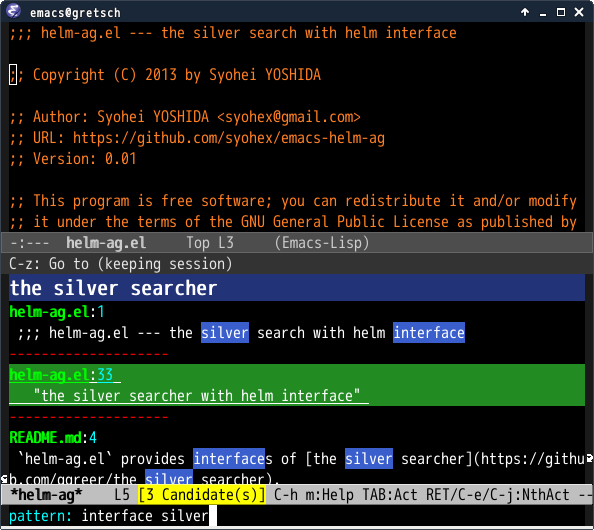

# helm-ag.el [![travis badge][travis-badge]][travis-link] [![melpa badge][melpa-badge]][melpa-link] [![melpa stable badge][melpa-stable-badge]][melpa-stable-link]

## Introduction
`helm-ag.el` provides interfaces of [The Silver Searcher](https://github.com/ggreer/the_silver_searcher) with helm.


## Screenshot




## Requirements

* Emacs 24 or higher
* helm 1.5.6 or higher
* [The Silver Searcher](https://github.com/ggreer/the_silver_searcher) 0.15pre or higher.

Please use older version(0.04) helm-ag, if you use the silver searcher 0.14 or lower.
You can get older helm-ag from [here](https://github.com/syohex/emacs-helm-ag/tags).


## Installation

You can install `helm-ag.el` from [MELPA](https://github.com/milkypostman/melpa.git) with package.el (`M-x package-install helm-ag`).


## Basic Usage

#### `helm-ag`

Input search word with `ag` command. You can change search directory
with `C-u` prefix.

#### `helm-ag-this-file`

Same as `helm-ag` except to search only current file

#### `helm-do-ag`

Search with `ag` like `helm-do-grep`.


#### `helm-ag-pop-stack`

Move to point before jump

#### `helm-ag-clear-stack`

Clear context stack


## Persistent action

You can see file content temporarily by persistent action(`C-z`)
at `helm-ag` and `helm-ag-this-file`.


## Customize

#### `helm-ag-base-command`(Default: `ag --nocolor --nogroup`)

Base command of `ag`.

#### `helm-ag-command-option`(Default: `nil`)

Command line option of base command.

#### `helm-ag-insert-at-point`(Default: `'nil`)

Insert thing at point as default search pattern, if this value is `non nil`.
You can set the parameter same as `thing-at-point`(Such as `'word`, `symbol` etc).

#### `helm-ag-source-type`(Default: `'one-line`)

If this value is `'file-line`, `helm-ag` displays candidate as helm `file-line` style.


### Sample Configuration

```lisp
(setq helm-ag-base-command "ag --nocolor --nogroup --ignore-case")
(setq helm-ag-command-option "--all-text")
(setq helm-ag-insert-at-point 'symbol)
```

### For [projectile](https://github.com/bbatsov/projectile/) users

You can use `helm-ag` with `projectile` by following command.

```lisp
(defun projectile-helm-ag ()
  (interactive)
  (helm-ag (projectile-project-root)))
```

## Alternatives

[ag.el](https://github.com/Wilfred/ag.el) provides `M-x grep` interface.
Also it can work without helm.

[travis-badge]: https://travis-ci.org/syohex/emacs-helm-ag.png
[travis-link]: https://travis-ci.org/syohex/emacs-helm-ag
[melpa-link]: http://melpa.org/#/helm-ag
[melpa-stable-link]: http://stable.melpa.org/#/helm-ag
[melpa-badge]: http://melpa.org/packages/helm-ag-badge.svg
[melpa-stable-badge]: http://stable.melpa.org/packages/helm-ag-badge.svg
